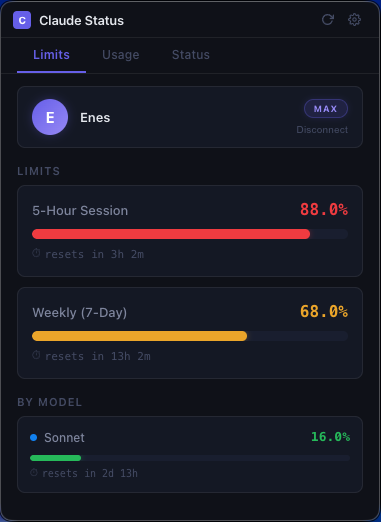
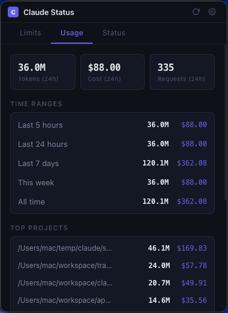
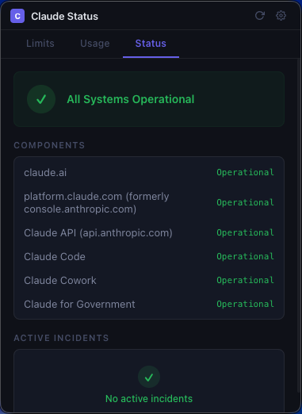

# Claude Status — Menu Bar Usage Monitor for Claude Code

> A lightweight menu bar app that tracks your Claude Code subscription limits, token usage, cost estimates, and Claude service health — all from your system tray.

> **Fork note:** This fork replaces `better-sqlite3` (native C++ addon) with [`sql.js`](https://github.com/sql-js/sql.js) (pure JavaScript/WASM). This eliminates the need for native compilation tooling (node-gyp, C++ build tools) and avoids install failures on newer environments. See [What Changed in This Fork](#what-changed-in-this-fork) for details.

<p align="center">
  
  
  
  
  
  
</p>

---

<p align="center">
  
  
  
</p>

---

## What Does It Do?

Claude Status sits in your menu bar and gives you instant answers to:

- **"Am I about to hit my rate limit?"** — See your 5-hour session and weekly usage limits as color-coded progress bars with reset countdowns.
- **"How much have I spent?"** — Token counts and cost estimates calculated from your local Claude Code session data using official Anthropic pricing.
- **"Is Claude down right now?"** — Real-time service health monitoring with incident tracking and desktop notifications when outages are detected or resolved.

---

## Features

### Subscription Limit Tracking
Track your Claude rate limits in real time so you never get throttled by surprise.

- **5-hour session limit** — live progress bar with utilization percentage and reset countdown
- **7-day weekly limit** — rolling weekly usage against your plan's rate limit
- **Per-model limits** — separate bars for Opus and Sonnet usage (when available)
- **Extra usage tracking** — monitor overage credits if enabled on your account
- **Color-coded alerts** — green (< 50%), amber (50–79%), red (80%+)

### Usage Analytics & Cost Estimation
Know exactly how much you're using across all your projects — no API key required.

- **Token tracking** — input, output, cache-write, and cache-read tokens per session
- **Cost estimates** — calculated locally from official Anthropic pricing tables
- **Time windows** — last 5 hours, 24 hours, 7 days, current week, and all-time totals
- **Per-project breakdown** — top projects ranked by token count and estimated cost
- **Per-model breakdown** — usage split across Claude Opus, Sonnet, and Haiku

### Service Health & Incident Monitoring
Stop wasting time when Claude is down. Get notified the moment something breaks — and when it's fixed.

- **Live status** — operational / degraded / major outage / maintenance
- **Incident tracking** — unresolved and recent incidents with full update timelines
- **Scheduled maintenance** — upcoming maintenance windows shown in advance
- **Desktop notifications** — alerts when outages are detected and when service recovers
- **Smart health engine** — merges official status with community signals for early detection

### Designed for Developers
- **Menu bar native** — lives in your system tray, no dock icon, no window clutter
- **Auto-refresh** — limits every 2 minutes, local usage every 30 seconds
- **One-time setup** — paste your session key once, stays connected across launches
- **Dark theme** — professional dark UI that matches your development environment
- **Fully local** — all data stays on your machine, no telemetry, no cloud sync

---

## Installation

### Prerequisites

- **Node.js 20+** — [nodejs.org](https://nodejs.org)
- An active **Claude Code** subscription (Pro, Max, or Team)

### macOS

```bash
# Install Node.js (if not installed)
brew install node

# Clone and run
git clone https://github.com/jlaprade-git/claude_status.git
cd claude_status
npm install
npm run dev
```

The app appears in your **menu bar** (top-right area). Click the icon to open the dashboard.

### Windows

```powershell
# Install Node.js from https://nodejs.org (LTS recommended)

# Clone and run
git clone https://github.com/jlaprade-git/claude_status.git
cd claude_status
npm install
npm run dev
```

The app appears in your **system tray** (bottom-right area). Click the icon to open the dashboard.

### Linux (Ubuntu/Debian)

```bash
# Install Node.js
curl -fsSL https://deb.nodesource.com/setup_20.x | sudo -E bash -
sudo apt-get install -y nodejs

# Clone and run
git clone https://github.com/jlaprade-git/claude_status.git
cd claude_status
npm install
npm run dev
```

The app appears in your **system tray** (if supported by your desktop environment).

### Building for Distribution

```bash
# Build production binaries
npm run build
cd apps/desktop
npx electron-builder

# Output:
#   macOS  → dist/Claude Status.dmg
#   Windows → dist/Claude Status Setup.exe
#   Linux  → dist/Claude Status.AppImage
```

---

## How It Works

### 1. Local Usage Data

Claude Code writes JSONL files to `~/.claude/projects/` after each session. Claude Status reads these files directly — no API key required. It parses token counts (input, output, cache-write, cache-read), maps them to models, and calculates cost estimates using Anthropic's published pricing.

### 2. Subscription Limits

Rate limit data (5-hour session, 7-day weekly) is fetched from the `claude.ai` API using your browser session. To connect:

1. Click the **Limits** tab → **Open claude.ai**
2. Sign in to claude.ai in your default browser
3. Open DevTools (`F12`) → **Application** → **Cookies** → `claude.ai`
4. Copy the `sessionKey` value and paste it into the app

The session key is stored locally in Electron's app data directory and is never sent to any third-party server. You only need to do this once.

### 3. Service Health

The app polls the official [Claude status page](https://status.anthropic.com) for real-time health data. An incident correlator merges official status with anomaly detection to produce confidence-weighted assessments: `healthy`, `possible_issue`, `confirmed_outage`, `maintenance`, or `recovering`.

### 4. Cost Calculation

Costs are estimated from token counts using a local pricing engine with per-model rates for Opus, Sonnet, and Haiku (including cache token pricing). No usage data is sent anywhere — all calculations happen locally.

---

## Tech Stack

| Layer | Technology |
|---|---|
| App shell | [Electron](https://electronjs.org) 41 |
| UI | [React](https://react.dev) 19 + TypeScript 5.5 |
| Build tool | [electron-vite](https://electron-vite.org) |
| Local storage | [sql.js](https://github.com/sql-js/sql.js) (SQLite via WASM) |
| Monorepo | npm workspaces |

---

## Project Structure

```
claude-status/
├── packages/
│   └── core/                     # Shared types, parsers, pricing engine
│       └── src/
│           ├── shared-types/     # UsageRecord, SubscriptionState, ServiceHealth
│           ├── usage-parser/     # JSONL parser and time-window aggregator
│           ├── metrics-engine/   # PricingCalculator, AnomalyDetector
│           ├── provider-claude-status/  # Status page API client
│           ├── provider-claude-api/     # claude.ai usage API client
│           └── incident-correlator/     # Multi-signal incident detection
├── apps/
│   └── desktop/
│       └── src/
│           ├── main/             # Electron main process, tray, popup window
│           ├── preload/          # IPC bridge
│           ├── renderer/         # React UI (tabs, components, hooks)
│           └── modules/
│               ├── auth/         # Session key management
│               ├── usage/        # JSONL file scanner
│               ├── subscription/ # Subscription limit fetcher
│               ├── notifications/# Desktop notification engine
│               └── settings/     # SQLite database, user preferences
├── assets/                       # Screenshots and images
└── package.json                  # Workspace root
```

---

## Privacy

Claude Status is designed to keep your data local:

- **No telemetry** — the app does not phone home, send analytics, or track usage
- **No data uploads** — token counts, costs, and project names never leave your machine
- **Session key stored locally** — saved in Electron's sandboxed app data directory, never shared with third parties
- **Read-only access** — the app reads `~/.claude/` but never writes to it
- **Minimal network requests** — only connects to `claude.ai` (your own account) and the Claude status page

---

## What Changed in This Fork

This fork replaces `better-sqlite3` with `sql.js` to remove the native compilation dependency. The original repo uses `better-sqlite3` which requires `node-gyp` and a C++ compiler to build. While this works for most setups, `sql.js` eliminates that requirement entirely — it's pure JavaScript/WASM and installs cleanly everywhere with no build tools needed.

### Changes

| File | Change |
|---|---|
| `apps/desktop/src/modules/settings/database.ts` | Rewritten to use sql.js. `DatabaseManager` now uses a static async `create()` factory method instead of a sync constructor (WASM initialization is async). Database auto-saves to disk every 30 seconds. |
| `apps/desktop/src/main/index.ts` | Updated to use async `DatabaseManager.create()` with fallback to no-persistence mode on failure. |
| `apps/desktop/electron.vite.config.ts` | Added Vite plugin to copy `sql-wasm.wasm` to build output. |
| `apps/desktop/package.json` | Replaced `better-sqlite3` with `sql.js`, removed `electron-rebuild` and `@types/better-sqlite3`, bumped Electron 33 to 41. |
| `package.json` | Updated ESLint 8 to 9, `@typescript-eslint/*` 7 to 8. |

### Tradeoffs

- **sql.js is slightly slower** than better-sqlite3 for heavy workloads (WASM vs native C). For a usage tracker doing simple inserts and reads, this is negligible.
- **Database is in-memory with periodic file saves** (every 30s + on close) rather than direct file I/O. Up to 30s of data could be lost on a hard crash, but the app re-scans log files on startup anyway.

---

## Contributing

Contributions are welcome! Please:

1. Fork the repository and create a feature branch
2. Run `npm run build` to verify your changes compile
3. Open a pull request with a clear description of the change

For large changes, open an issue first to discuss the approach.

---

## License

MIT — see [LICENSE](./LICENSE) for details.
